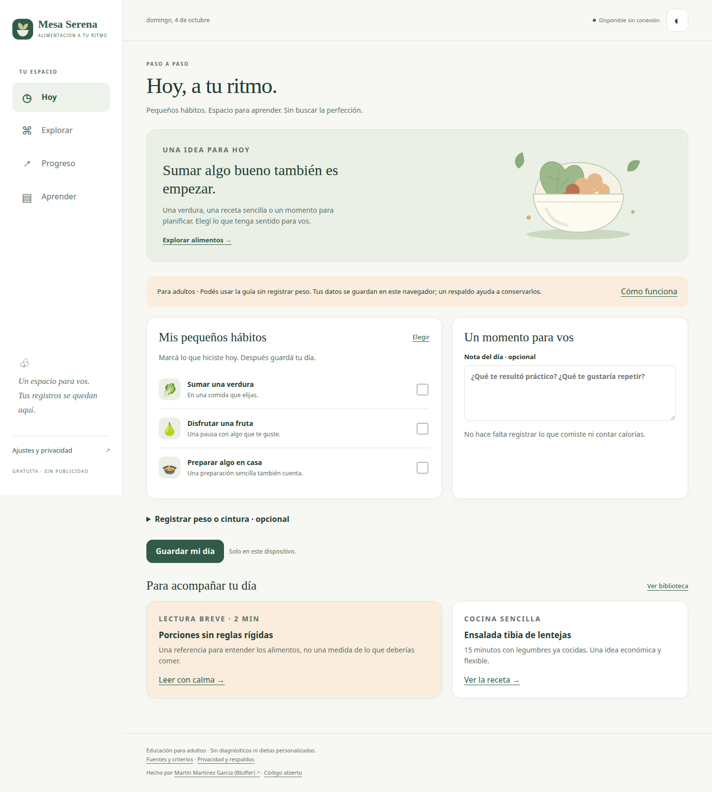

# Mesa Serena

**Alimentación a tu ritmo.** Una PWA gratuita y de código abierto para adultos: alimentos, recetas, lecturas y pequeños hábitos, con registros guardados en el navegador.

**[Abrir la aplicación](https://martnmartnez14.github.io/mesa-serena/)** · [Fuentes](docs/science/SOURCES.md) · [Privacidad](docs/PRIVACY.md)



## Qué incluye

- 50 fichas con composición USDA, preparación y conversión de porciones.
- 10 recetas originales con estimaciones calculadas a partir de sus ingredientes.
- 8 lecturas con fuentes y fecha de revisión documental.
- Hasta tres hábitos, notas, peso y cintura opcionales; historial, gráficos SVG y tablas.
- Favoritos, búsqueda, modo oscuro y opción para ocultar mediciones.
- Exportación y restauración JSON validadas; eliminación de datos.
- Uso offline tras la primera descarga completa. Sin cuentas, publicidad ni analítica.

Es educación general, no un tratamiento, diagnóstico o plan nutricional personalizado. El contenido no tiene revisión clínica independiente. No se ha demostrado eficacia clínica de esta aplicación.

## Abrir localmente sin instalar paquetes

Desde esta carpeta, usando Python ya disponible:

```sh
python3 -m http.server 8765 --bind 127.0.0.1
```

Abrir `http://127.0.0.1:8765`. Usar HTTP local, no abrir `index.html` como archivo: los módulos y service workers necesitan un origen válido. El servidor no expone la carpeta a otros equipos de la red.

No se necesita npm, Android Studio, SDK, framework ni compilación. `package.json` solo configura módulos y pruebas si ya hay Node disponible.

## Offline e instalación

Esperar **Disponible sin conexión**. Chrome y otros navegadores compatibles pueden ofrecer instalación; también se puede usar como web. La disponibilidad exacta depende del navegador. Una nueva versión se activa mediante un botón, sin interrumpir formularios. Los datos personales están separados de la caché del contenido.

El navegador puede borrar almacenamiento. Exportar respaldos privados regularmente. No hay sincronización ni cifrado propio; el archivo exportado contiene los registros en texto claro. Los proyectos del mismo dominio GitHub Pages comparten origen: los nombres específicos de base y caché no proporcionan aislamiento de seguridad frente a otros proyectos de ese dominio.

## Desarrollo y pruebas

- Lógica y validación: `node tests/core.test.mjs` (si Node ya está disponible).
- Pruebas sin Node: abrir `/tests/index.html` desde el servidor local.
- Catálogo, referencias y caché: `python3 scripts/validate.py`.
- E2E: con una instalación **ya existente** de Playwright y Chrome, `PLAYWRIGHT_PATH=/ruta/a/playwright node tests/e2e.cjs`. No ejecuta instalaciones.
- Después de cambiar archivos de la aplicación: `python3 scripts/update_cache.py`.
- Detalles y límites: [informe de pruebas](docs/testing/REPORT.md).

La vista móvil se prueba con un navegador de escritorio. La instalación y experiencia en un teléfono físico siguen pendientes.

## Estructura

`js/` contiene interfaz, cálculos y almacenamiento; `data/`, el catálogo y las referencias; `assets/`, recursos propios; `sw.js`, el manifiesto offline generado desde `scripts/sw-template.js`. No hay servicios externos de ejecución.

Los datos USDA se extraen reproduciblemente con `scripts/extract_foods.py` a partir del archivo oficial indicado en `data/provenance.json`. El archivo completo no se incluye ni se descarga durante el uso de la app.

## Publicación

GitHub Pages sirve la rama `main` y carpeta raíz. `.nojekyll` evita procesamiento innecesario. La CI comprueba cálculos, datos y caché; no instala dependencias de proyecto. Las rutas usan fragmentos y los recursos son relativos para funcionar bajo `/mesa-serena/`.

## Autoría, licencias y apoyo

Creado por **[Martín Martínez García (Bluffer)](https://github.com/MartnMartnez14)**.

Código e ilustraciones originales: [MIT](LICENSE). Textos editoriales originales: [CC BY 4.0](CONTENT_LICENSE.md). Datos USDA: dominio público con atribución; conservar procedencia y límites. Marcas y textos de las fuentes enlazadas mantienen sus derechos.

El enlace de apoyo voluntario está desactivado hasta configurar una dirección confirmada en `data/config.json`. Ninguna función depende de donar.

Para reportar errores, abrir un issue **sin adjuntar mediciones, diarios ni respaldos personales**.
